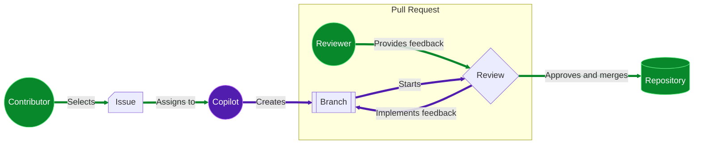

## Step 1: Copilot 코딩 에이전트 활성화

[GitHub Copilot 시작하기](/skills-kr/getting-started-with-github-copilot) 실습에서 코드 에디터에서 Copilot을 사용하여 Mergington 방과후 활동 사이트를 크게 업그레이드하는 방법을 배웠습니다. 🎻 ⚽️ ♟️

사실, 이 사이트는 이제 학교의 정규 도구가 되었습니다. 그리고 그런 관심은 좋지만, 문제를 하나 깨달았습니다! 다음 학기에 안식년을 떠나게 됩니다!

교장 선생님과 논의한 끝에, 새 기능 개발은 보류하기로 했지만... 걱정이 있습니다. 여러분이 없는 동안 간단한 변경 사항을 처리할 _무언가_가 필요합니다.

여러분이 없는 동안 업데이트를 처리할 수 있도록 Copilot을 (우리 학교에) 등록하여 선생님들이 성공할 수 있도록 준비합시다.

<details>
<summary>📸 웹사이트 스크린샷</summary><br/>


</details>

### 📖 이론: Copilot이 이제 여러분의 코딩 에이전트입니다

이전 실습에서는 Copilot **채팅**, **편집** 및 **에이전트** 모드를 사용했습니다. 이것들이 매우 유용했지만, **Copilot 코딩 에이전트**는 GitHub에서 완전히 작동하여 한 단계 더 발전했습니다. 코드 에디터가 필요 없습니다! 😎

| 기능           | 에디터에서의 Copilot         | Copilot 코딩 에이전트     |
| ----------------- | ----------------------------- | ------------------------ |
| **인터페이스**     | 코드 에디터              | 이슈 및 Pull Request |
| **작업 범위**    | 로컬 파일                   | 저장소               |
| **활성화**    | 인라인 코드 제안, 채팅 | 이슈 할당         |
| **커스터마이징** | 커스텀 지침           | 커스텀 지침      |
| **MCP 지원**   | 예                           | 예                      |
| **Vibe 코딩**   | 😎                            | 😎                       |

#### 어떻게 작동하나요?

기여자 관점에서 보면, 흐름은 일반적인 워크플로우와 매우 유사합니다.

1. **쓰기 권한**이 있는 기여자가 이슈를 선택하고 (자신 대신) Copilot에 할당합니다.
2. Copilot이 브랜치와 Pull Request를 생성합니다.
3. Copilot이 Actions 워크플로우에서 브랜치 작업을 수행하고 Pull Request 대화 탭을 통해 업데이트를 제공합니다.
4. Copilot이 이슈를 완료하면 할당자에게 리뷰를 요청합니다.
5. 할당자가 리뷰를 제출하거나, 댓글을 추가하거나, 승인합니다.
6. 피드백이 제공되면 Copilot이 이를 구현하기 위해 계속 작업합니다.
7. 요청자가 만족할 때까지 위 단계를 반복한 후 머지합니다.



#### 이것은 안전한가요?

우려를 줄이기 위해 여러 보안 예방 조치가 구현되어 있습니다. Copilot에게 이슈 작업을 요청할 때 고려해야 할 몇 가지 제한 사항은 다음과 같습니다.

- Copilot은 자신이 생성한 브랜치와 저장소에서 제공하는 리소스에서만 변경할 수 있습니다.
- Copilot은 인터넷 접근을 제한하는 [구성 가능한 방화벽](https://docs.github.com/en/enterprise-cloud@latest/early-access/copilot/coding-agent/customizing-copilot-coding-agents-development-environment#customizing-or-disabling-the-agents-firewall)이 있습니다.
- 쓰기 권한이 있는 사용자만 Copilot에 이슈를 할당할 수 있습니다.
- 이슈의 숨겨진 콘텐츠(주석 처리된 코드 등)는 무시됩니다.

> [!IMPORTANT]
> 완전한 완화 조치 및 구성 설정 목록은 [위험 및 완화 조치](https://docs.github.com/en/enterprise-cloud@latest/early-access/copilot/coding-agent/using-copilot-coding-agent#copilot-coding-agent-risks-and-mitigations) 문서에서 확인할 수 있습니다.

## ⌨️ 활동: (선택사항) 방과후 활동 사이트 알아보기

> [!NOTE]
> 개발 환경을 열고 애플리케이션을 실행하는 것은 이 실습을 완료하는 데 필수가 아닙니다. 원하시면 이 활동을 건너뛸 수 있습니다.

<details>
<summary>단계 보기</summary>

다른 실습에서 우리는 방과후 활동 웹사이트를 개발해왔습니다. 다음 단계를 따라 개발 환경을 시작하고 사용해 볼 수 있습니다.

1. 아래 버튼을 우클릭하여 새 탭에서 **Codespace 생성** 페이지를 여세요. 기본 설정을 사용하세요.

   [](https://codespaces.new/{{full_repo_name}}?quickstart=1)

1. 환경이 준비될 때까지 잠시 기다려 주세요. 모든 필수 요소와 서비스가 자동으로 설치됩니다.

1. **GitHub Copilot** 및 **Python** 확장이 설치되어 있고 활성화되어 있는지 확인하세요.

   <br/>
   

1. 애플리케이션을 실행해 보세요. 왼쪽 사이드바에서 **실행 및 디버그** 탭을 선택한 다음 **디버깅 시작** 아이콘을 누르세요.

   <details>
   <summary>📸 스크린샷 보기</summary><br/>

   

   </details>

   <details>
   <summary>🤷 문제가 있으신가요?</summary><br/>

   **실행 및 디버그** 영역이 비어 있으면 VS Code를 다시 로드해 보세요: 명령 팔레트(`Ctrl`+`Shift`+`P`)를 열고 `Developer: Reload Window`를 검색하세요.

   

   </details>

1. **Ports** 탭에서 웹페이지 주소를 찾아 열고 실행 중인지 확인하세요.

   <details>
   <summary>📸 스크린샷 보기</summary><br/>

   

   </details>

</details>

## ⌨️ 활동: 저장소에서 Copilot 코딩 에이전트 활성화

선생님들의 요청을 Copilot에 위임하기 전에, 저장소에 접근 권한을 부여해야 합니다.

1. 오른쪽 상단에서 **사용자 아이콘**을 클릭하고 **Settings**를 선택하세요.

   <br/>
   

1. 왼쪽 탐색에서 **Copilot** 섹션을 펼치고 **Coding agent**를 선택하세요.

   

1. **Repository access** 필드가 `All repositories`로 설정되어 있는지 확인하세요.

   또는 이 실습에만 활성화하려면 `Only selected repositories`를 선택하고 이 실습 저장소(`{{ full_repo_name }}`)를 선택하세요.


   

## ⌨️ 활동: Copilot에 이슈 할당

떠나기 전에 완료해야 할 중요한 이슈가 여러 개 있지만, 먼저 간단한 옵션 중 하나를 테스트해봅시다. 이를 통해 상호작용과 협업이 어떻게 작동하는지 확인하고, 다른 선생님들을 위한 문서를 업데이트할 수 있습니다. 대부분의 선생님들은 전통적인 코딩 에디터 사용법을 모릅니다!

> [!TIP]
> 이슈의 목표와 수락 기준을 명확하게 만드세요. 또한, 큰 작업을 짧은 작업으로 나누면 피드백의 기회가 더 많아집니다!

1. 이 실습 저장소의 **Issues** 탭으로 이동하여 **New Issue** 버튼을 클릭하세요.

1. **Title**을 다음과 같이 설정하세요:

   ```md
   Missing Activity: Manga Maniacs
   ```

   아래 텍스트를 설명으로 입력하고 **Create** 버튼을 클릭하세요.

   ```md
   The manga club was recently announced and is naturally missing from the website. Please add it.

   Here are the details:

   Description: Explore the fantastic stories of the most interesting characters from Japanese Manga (graphic novels).

   Schedule: Tuesdays at 7pm
   Max attendance: 15 people
   ```

1. 오른쪽 상단에서 **Assignees** 영역을 클릭하고 **Copilot**을 선택하세요.

   

1. 이슈를 Copilot에 할당하면 잠시 후 다음을 확인할 수 있습니다:

   - 이슈에 `👀` 반응이 추가되어 Copilot이 이슈를 읽고 있음을 나타냅니다.
   - 활동 로그에 이슈를 Copilot에 할당했다는 것이 표시됩니다.
   - 이슈 로그에 연결된 Pull Request가 포함됩니다.

   

1. 이슈가 할당되면 Mona가 여러분의 작업을 확인합니다. 다음 단계를 공유할 때까지 잠시 기다려 주세요.

<details>
   <summary>문제가 있으신가요? 🤷</summary><br/>

피드백을 받지 못한 경우 다음 사항을 확인하세요:

- 올바른 이슈를 할당했는지 확인하세요. 다른 이슈에서 연습하면 무시됩니다.

</details>
