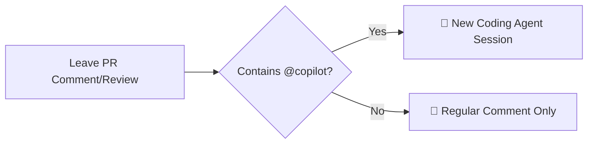

## Step 2: Copilot과 협업하기

Copilot에 이슈를 할당했으니, Copilot이 Pull Request도 시작하고 이슈에 연결한 것을 볼 수 있습니다!

다른 팀원과 하는 것처럼 Copilot의 작업을 리뷰하고 피드백을 제공하는 방법을 배워봅시다.

### 📖 이론: Copilot의 협업 워크플로우 이해하기

Copilot은 Pull Request의 여러 채널을 통해 작업에 대한 투명성을 제공합니다. 살펴봅시다!

#### 📝 Pull Request 설명

설명은 Copilot이 작업을 진행하면서 지속적으로 업데이트됩니다. 실시간으로 설명 업데이트를 확인할 수 있습니다!


#### 🤖 코딩 에이전트 세션

Copilot은 모든 작업을 **세션** 안에서 수행합니다. 작업을 할당할 때마다 문제를 분석하고, 접근 방식을 계획하고, 변경 사항을 구현합니다. 첫 번째 세션은 코딩 에이전트가 할당되면 즉시 시작됩니다.

Pull Request 타임라인에서 Copilot이 작업을 시작하고 완료할 때의 진행 표시기를 볼 수 있습니다.

코딩 세션 로그에 두 가지 방법으로 접근할 수 있습니다:

- **🔴 실시간**: Copilot 코딩 에이전트 세션이 작업을 해결하기 위해 취하는 모든 단계와 로직을 실시간으로 확인
- **📋 리뷰**: Copilot이 작업을 완료한 후 세션 로그를 확인하여 결정 사항 검토

<details>
<summary>📸 Copilot 세션 로그 </summary><br/>


</details>

#### 💬 Copilot에 피드백 제공

Copilot이 작업을 완료하면, 다른 팀원과 마찬가지로 협업할 수 있습니다. 효과적인 협업의 핵심은 새로운 코딩 세션을 트리거하는 방법을 이해하는 것입니다:

Copilot은 `@copilot` 멘션이 포함된 댓글이나 Pull Request 리뷰에만 반응합니다.

이는 다른 인간 팀원을 위한 일반 댓글을 남길 수 있으며, Copilot이 불필요한 세션을 시작하지 않는다는 것을 의미합니다!



#### ⚙️ 중요 고려사항

- Copilot의 작업은 `copilot/*` 규칙의 브랜치에서 수행되며 다른 브랜치에는 접근할 수 없습니다
- Copilot은 Actions 워크플로우를 트리거할 수 없습니다. Pull Request에서 트리거되는 워크플로우는 실행 전 사람의 승인이 필요합니다
- 규칙셋 및 유사한 보호 기능은 여전히 적용됩니다

> [!TIP]
> Copilot이 생성한 모든 작업은 할당자를 공동 기여자로 커밋됩니다(기여 그래프를 안전하게 유지). 💕

### ⌨️ 활동: Copilot의 진행 상황 확인

1. 이슈에서 Copilot이 참조한 **Pull Request**로 이동하세요.

1. Copilot이 Pull Request 설명을 업데이트하는 것을 실시간으로 확인하세요. 3단계를 거칩니다:

   <details>
      <summary>1. 시작할 때, Copilot이 이슈의 초기 사본을 제공합니다. <b>[이미지 보기]</b></summary>
      
   </details>

   <details>
      <summary>2. 계획 후, Copilot이 작업 항목 세트를 제공합니다. <b>[이미지 보기]</b></summary>
      
   </details>

   <details>
      <summary>3. 완료 후, Copilot이 요약을 제공합니다. <b>[이미지 보기]</b></summary>
      
   </details>

1. 약간 아래로 스크롤하여 Copilot이 제공한 타임라인과 고수준 메모를 확인하세요. **View session** 버튼을 클릭하세요.

   

1. 새 페이지에서 Copilot의 작업 저널을 볼 수 있습니다. 오른쪽에서 실시간으로 작업 중인 Pull Request의 개요를 볼 수 있습니다.

   

1. Copilot 세션이 아직 진행 중이라면 세션 저널을 모니터링하세요.

1. Copilot이 작업을 완료하고 Pull Request의 리뷰어로 요청하면, 다음 활동으로 진행할 수 있습니다!

> [!TIP]
> **edited** 드롭다운을 사용하여 Pull Request 설명 변경 이력을 볼 수 있습니다.
>
> <details>
> <summary>이미지 보기</summary>
> 
> </details>

### ⌨️ 활동: Copilot에 피드백 제공

Copilot이 작업 세션을 완료했으니, 작업을 리뷰하고 피드백을 제공합시다!

1. Pull Request에서 **Add your review** 버튼을 클릭하세요.

   

1. Copilot이 생성한 새 항목을 찾으세요. 라인에 마우스를 올리면 플러스 기호가 나타납니다. **클릭**하여 댓글 추가 대화 상자를 여세요.

   

1. 설명을 읽어보면 일본 만화의 정신에 맞게 더 재미있어야 한다고 생각됩니다. Copilot에 수정을 요청합시다. 다음 텍스트를 입력하고 **Start a review**를 클릭하세요.

   ```md
   @copilot Please change this description to be inspired by Japanese Manga.
   It needs more personality to attract students.
   ```

1. 변경 사항 목록 상단에서 **Finish your review** 버튼을 클릭하고 **Submit Review**를 선택하세요.

1. 잠시 후, Copilot이 새 에이전트 세션에서 요청한 변경 사항을 작업하기 시작합니다. Pull Request 타임라인에 나타날 새 **View session** 버튼을 클릭하세요.

    

1. 보시다시피, Copilot이 새 세션에서 요청한 변경 사항 작업을 시작했습니다. 그러나 이전 세션의 로그를 다시 볼 수 있도록 전체 세션 저널이 여기에 보관됩니다!

   

1. 세션 중에 처음에 추가하는 것을 잊었거나, Copilot이 잘못된 방향으로 가고 있는 것을 발견하면 Copilot을 조정할 수도 있습니다.

   > 🪧 **참고:** 이 단계는 선택사항입니다. 요청한 변경 사항에 대한 코딩 에이전트 세션이 이미 완료된 경우 이 단계를 건너뛰어도 됩니다!

   세션 로그 바로 아래의 하단 채팅 패널을 사용하여, 방금 생긴 새 정보를 제공하세요!

   ```md
   There is a slight change of plans - we got a bigger classroom assignment for this class

   Let's move the schedule to 5PM tuesday and change the maximum allowed participants to 25.
   ```

1. Copilot이 변경 사항 작업을 완료할 때까지 기다리세요.

   > 🪧 **참고:** 시간이 걸릴 수 있습니다! 새 세션을 모니터링하거나 잠시 쉴 수 있습니다.

1. Copilot이 완료되면 다시 리뷰어로 요청받습니다.

1. **Ready to Review** 버튼을 클릭하여 Pull Request를 활성화한 다음 **Merge** 버튼을 클릭하세요.

1. Pull Request가 머지되면 Mona가 작업을 확인합니다. 다음 레슨을 응답할 때까지 잠시 기다려 주세요.

<details>
<summary>문제가 있으신가요? 🤷</summary><br/>

피드백을 받지 못한 경우 다음 사항을 확인하세요:

- 리뷰에 `@copilot` 멘션이 포함되어 있는지 확인하세요
- 이 실습의 다음 단계로 진행하려면 Pull Request를 머지해야 합니다!

</details>
